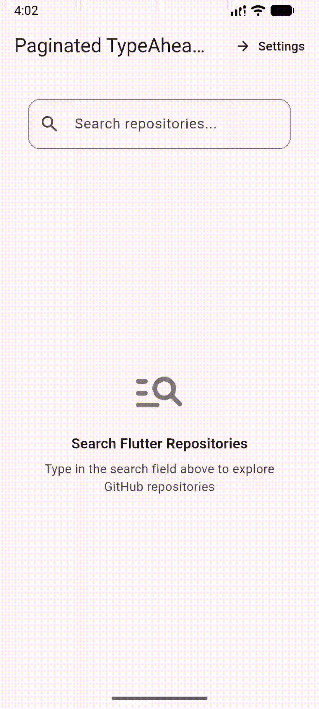

# Paginated TypeAhead

A TypeAhead (autocomplete) widget for Flutter with built-in infinite scroll pagination, debouncing, and modern declarative overlay management.

[](https://pub.dev/packages/paginated_typeahead)
[](LICENSE)



## Features

- **Infinite Scroll Pagination**: Automatically loads more suggestions as the user scrolls to the bottom of the dropdown.
- **Modern Dart 3 Records**: Clean `(List<T>? items, bool hasMore)` response contract for pagination callbacks.
- **Declarative Overlay Architecture**: Powered by Flutter's `OverlayPortal` for smooth rendering without manual overlay lifecycle issues.
- **Deep Customization**:
  - Custom search text field builder (`builder`)
  - Item builder (`itemBuilder`) & item separators (`separatorBuilder`)
  - Initial loading (`loadingBuilder`) & load-more progress (`loadMoreLoadingBuilder`)
  - Empty results (`emptyBuilder`)
  - Error state (`errorBuilder`) & load-more retry (`loadMoreErrorBuilder`)
- **Smart Auto-Flipping**: Automatically switches dropdown direction (`down` / `up`) when space below is constrained or keyboard appears.
- **Debounce & Threshold**: Configurable debounce duration and minimum characters threshold.
- **Programmatic Controller**: Open, close, toggle, or select items programmatically via `SuggestionsController`.
- **Form Support**: Seamlessly integrates with Flutter forms (`validator`, `autovalidateMode`, `inputFormatters`).

---

## Getting Started

Add `paginated_typeahead` to your `pubspec.yaml`:

```yaml
dependencies:
  paginated_typeahead: ^1.0.0
```

Or install it via terminal:

```bash
flutter pub add paginated_typeahead
```

Import the package:

```dart
import 'package:paginated_typeahead/paginated_typeahead.dart';
```

---

## Usage

### Basic Example

```dart
PaginatedTypeAhead<User>(
  initialPage: 1,
  suggestionsCallback: (query, page) async {
    final response = await apiService.getUsers(query: query, page: page);
    return (response.users, response.hasMorePages);
  },
  itemBuilder: (user) => ListTile(
    title: Text(user.name),
    subtitle: Text(user.email),
  ),
  onSelected: (user) {
    print('Selected user: ${user.name}');
  },
)
```

---

### Custom Text Field Builder

Use the `builder` parameter to supply your own custom `TextFormField`, input decoration, or custom styling:

```dart
PaginatedTypeAhead<User>(
  initialPage: 1,
  builder: (context, controller, focusNode) {
    return TextFormField(
      controller: controller,
      focusNode: focusNode,
      decoration: InputDecoration(
        hintText: 'Search users...',
        prefixIcon: const Icon(Icons.search),
        border: OutlineInputBorder(
          borderRadius: BorderRadius.circular(12),
        ),
      ),
    );
  },
  suggestionsCallback: (query, page) async {
    final response = await apiService.getUsers(query: query, page: page);
    return (response.users, response.hasMorePages);
  },
  itemBuilder: (user) => ListTile(
    title: Text(user.name),
  ),
  onSelected: (user) => print(user.name),
)
```

> **Note**: Both `controller` and `focusNode` provided by the builder must be passed to your text field for overlay positioning and typing events to work properly.

---

### Customizing Status & Pagination Builders

You can customize each state of the search and pagination lifecycle:

```dart
PaginatedTypeAhead<Repository>(
  initialPage: 1,
  suggestionsCallback: (query, page) => repository.search(query, page),
  itemBuilder: (repo) => ListTile(title: Text(repo.name)),
  onSelected: (repo) => selectRepo(repo),
  // Separator between items
  separatorBuilder: (context, index) => const Divider(height: 1),
  // Initial loading indicator
  loadingBuilder: (context) => const Padding(
    padding: EdgeInsets.all(16),
    child: Center(child: CircularProgressIndicator()),
  ),
  // Indicator at the bottom while loading the next page
  loadMoreLoadingBuilder: (context) => const Padding(
    padding: EdgeInsets.all(12),
    child: Center(
      child: SizedBox(
        width: 20,
        height: 20,
        child: CircularProgressIndicator(strokeWidth: 2),
      ),
    ),
  ),
  // Widget displayed when no items match the query
  emptyBuilder: (context) => const Padding(
    padding: EdgeInsets.all(16),
    child: Center(child: Text('No repositories found')),
  ),
  // Widget displayed when initial fetch fails
  errorBuilder: (context, error) => Padding(
    padding: const EdgeInsets.all(16),
    child: Center(
      child: Text(
        'Failed to load: $error',
        style: TextStyle(color: Theme.of(context).colorScheme.error),
      ),
    ),
  ),
  // Retry widget displayed when loading more fails
  loadMoreErrorBuilder: (context, retry) => Padding(
    padding: const EdgeInsets.all(12),
    child: Center(
      child: TextButton.icon(
        onPressed: retry,
        icon: const Icon(Icons.refresh, size: 18),
        label: const Text('Retry loading more'),
      ),
    ),
  ),
)
```

---

### Programmatic Control via `SuggestionsController`

Use `SuggestionsController` to programmatically open, close, toggle, or select items:

```dart
final suggestionsController = SuggestionsController<User>();

// Open dropdown
suggestionsController.open();

// Close dropdown
suggestionsController.close();

// Toggle dropdown visibility
suggestionsController.toggle();

// Select an item programmatically
suggestionsController.select(user);

// Check if open
final isOpen = suggestionsController.isOpen;

// Pass to the widget:
PaginatedTypeAhead<User>(
  suggestionsController: suggestionsController,
  initialPage: 1,
  suggestionsCallback: (query, page) => fetchUsers(query, page),
  itemBuilder: (user) => ListTile(title: Text(user.name)),
  onSelected: (user) => handleSelect(user),
)
```

---

## API Reference

### `PaginatedTypeAhead<T>` Properties

| Property | Type | Description | Default |
| :--- | :--- | :--- | :--- |
| `initialPage` | `int` | The starting page number passed to `suggestionsCallback`. | **Required** |
| `suggestionsCallback` | `AutocompleteSuggestionsCallback<T>` | Fetches suggestions for `(query, page)`. Returns `(List<T>? items, bool hasMore)`. | **Required** |
| `itemBuilder` | `AutocompleteItemBuilder<T>` | Builds the widget for each suggestion item. | **Required** |
| `onSelected` | `ValueChanged<T>?` | Called when a suggestion item is selected. | `null` |
| `builder` | `SuggestionsFieldBuilder?` | Custom builder for the search text field `(context, controller, focusNode)`. | `null` |
| `separatorBuilder` | `IndexedWidgetBuilder?` | Builds a separator between suggestion items. | `null` |
| `loadingBuilder` | `WidgetBuilder?` | Custom builder shown while initial suggestions are loading. | Built-in spinner |
| `loadMoreLoadingBuilder` | `WidgetBuilder?` | Custom builder shown at bottom while loading the next page. | Built-in spinner |
| `emptyBuilder` | `WidgetBuilder?` | Custom builder shown when no items match. | Built-in message |
| `errorBuilder` | `SuggestionErrorBuilder?` | Custom builder shown when initial fetch fails `(context, error)`. | Built-in message |
| `loadMoreErrorBuilder` | `LoadMoreErrorBuilder?` | Custom builder shown when next page fetch fails `(context, retry)`. | Built-in retry button |
| `controller` | `TextEditingController?` | Controller for the search field text. | Auto-managed |
| `focusNode` | `FocusNode?` | Focus node for the search field. | Auto-managed |
| `suggestionsController` | `SuggestionsController<T>?` | Controller to programmatically control the dropdown. | `null` |
| `hintText` | `String` | Placeholder text for default search field. | `'Search...'` |
| `debounceDuration` | `Duration` | Delay to wait after user stops typing before triggering search. | `300ms` |
| `minCharsForSuggestions` | `int` | Minimum characters required to trigger suggestions. | `0` |
| `direction` | `VerticalDirection` | Preferred vertical direction (`down` or `up`). | `VerticalDirection.down` |
| `autoFlipDirection` | `bool` | Whether to automatically flip direction when space is constrained. | `true` |
| `autoFlipMinHeight` | `double` | Minimum vertical height below field before flipping upwards. | `64.0` |
| `hideOnUnfocus` | `bool` | Whether dropdown closes when the text field loses focus. | `true` |
| `hideOnSelect` | `bool` | Whether dropdown closes when an item is selected. | `true` |
| `clearOnClose` | `bool` | Whether to clear the text query and results when dropdown closes. | `false` |
| `constrainWidth` | `bool` | Whether the dropdown width matches the text field width. | `true` |
| `dropdownConstraints` | `BoxConstraints` | Additional size constraints for the suggestions dropdown overlay. | `BoxConstraints()` |
| `offset` | `Offset?` | Offset applied to dropdown overlay position. | `null` |
| `inputDecoration` | `InputDecoration?` | Decoration for the default text field. | Styled default |
| `validator` | `FormFieldValidator<String>?` | Form validation logic. | `null` |
| `autovalidateMode` | `AutovalidateMode?` | Auto-validation mode for form validation. | `null` |
| `keyboardType` | `TextInputType?` | Keyboard type for the text field. | `null` |
| `inputFormatters` | `List<TextInputFormatter>?` | Formatters applied to the text field input. | `null` |

---

## Example Application

Check out the [`example`](example) directory for a complete demo application featuring:
- Live GitHub repository search with Dio and pagination
- Custom search field styling
- Interactive settings to toggle `debounce`, `direction`, `dividers`, `constrainWidth`, `darkMode`, and more.

---

## License

This project is licensed under the MIT License - see the [LICENSE](LICENSE) file for details.